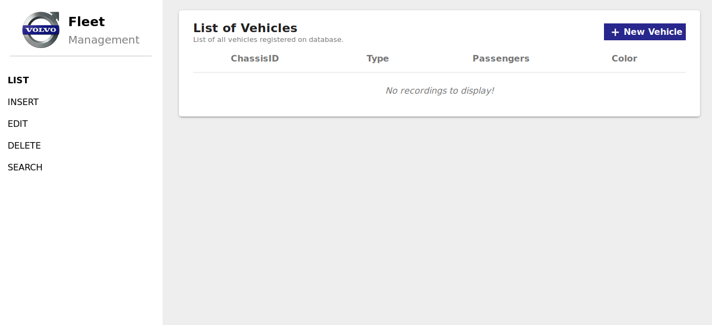
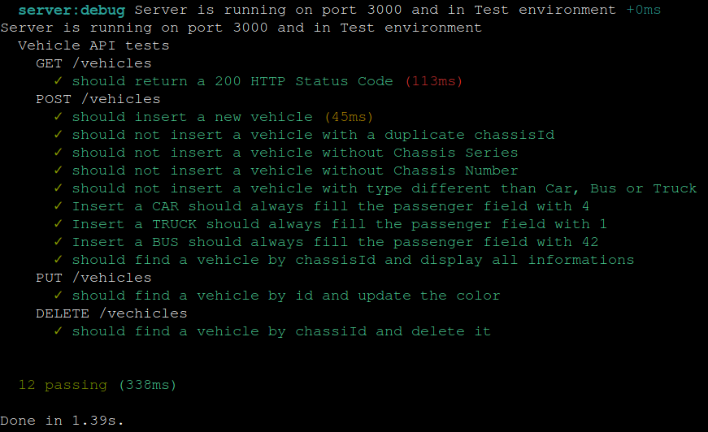

<div align="center">
  
  <span> &nbsp &nbsp &nbsp &nbsp</span>
   
  <span> &nbsp &nbsp &nbsp &nbsp</span>
  
  <span> &nbsp &nbsp &nbsp &nbsp</span>
  
</div>
<br />

<div align="center">
  <h3> BRQ Digital Solutions Full-Stack Developer Test </h3>
  <p> A simple fleet management CRUD </p>
</div>

## Requirements
 - To run this app, you need Docker (Docker Engine and Docker Compose) running on your machine.
  
## How to install Docker?
>  **NOTE:** You can skip this section if you already have Docker installed
 - **Windows**
    - Just follow the instructions in the <a href="https://docs.docker.com/docker-for-windows/install/"> documentation </a>. After installaing Docker, your environment will be ready to run this app.
   
 - **Linux**
    - In Linux/Unix environments, you need to install Docker-Engine first. Choose the Linux distro that you are using and follow the steps in the documentation:
      - <a href="https://docs.docker.com/install/linux/docker-ce/centos/"> CentOS </a>
      - <a href="https://docs.docker.com/install/linux/docker-ce/debian/"> Debian </a>
      - <a href="https://docs.docker.com/install/linux/docker-ce/fedora/"> Fedora </a>
      - <a href="https://docs.docker.com/install/linux/docker-ce/ubuntu/"> Ubuntu </a>
    - After installation, if you don't want to preface the docker command with sudo, create a Unix group called <i> docker </i>. To accomplish it, follow the instructions:
      
      - *Create the docker group*
      ```console
      user@name:~$ sudo groupadd docker
      ```
      
       - *Add your user to the docker group*
      ```console
      user@name:~$ sudo groupadd docker sudo usermod -aG docker $USER
      ```
      
      - *Log out and log back in so that your group membership is re-evaluated*
      
      - *Verify that you can run docker commands without sudo
       ```console
      user@name:~$ docker run hello-world
      ```
     - Install *Docker Compose* to orchestrate our containers:
     
        - Run this command to download the current stable release of Docker Compose:
        ```console
        user@name:~$ sudo curl -L "https://github.com/docker/compose/releases/download/1.25.0/docker-compose-$(uname -s)-$(uname -m)" -o /usr/local/bin/docker-compose
        ```
      
        - Appy executable permissions to the binary:
        ```console
        user@name:~$ sudo chmod +x /usr/local/bin/docker-compose
        ```
        
        - Test the installation:
        ```console
        user@name:~$ docker-compose --version
        docker-compose version 1.25.0, build 1110ad01
        ```
## Running the application
  - Clone this repository
  ```
  git clone https://github.com/BrNaka/brq-fullstack-test.git
  ```
  
  - In the project folder, build the *"frontend"* and *"backend"* images (*Since this app uses the Polymer Starter Kit, this step can take a few minutes to complete*):
  ```
  docker-compose build
  ```
  
  - After building, you can start the containers in *Two different environments*:
    
    - **Production environment**:
    ```
    docker-compose -f docker-compose.yml -f docker-compose.prod.yml up
    ```
    - **Development environment**:
    ```
    docker-compose -f docker-compose.yml -f docker-compose.dev.yml up
    ```
  - Open a browser, and access the web app in *http://localhost:8081*
  
<div align='center'> 
   
</div>
  
## Running Unit Tests
  - Use the following command to test the application
  ```
  docker-compose -f docker-compose.test.yml run backend sh -c "yarn test"
  ```
<div align='center'> 
   
</div>
  
